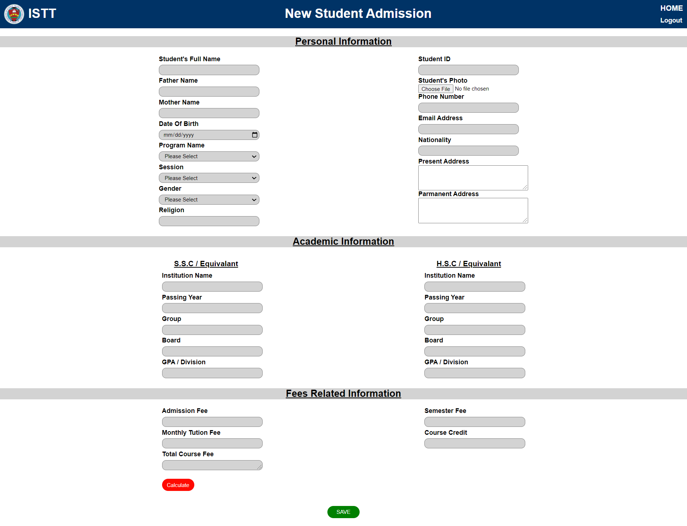
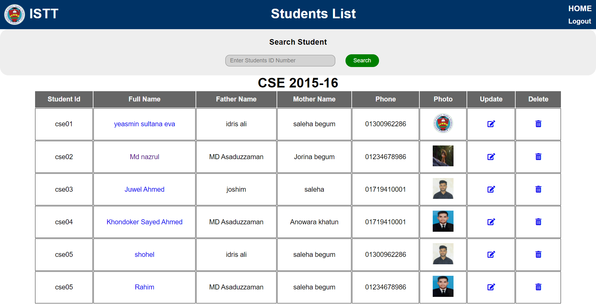
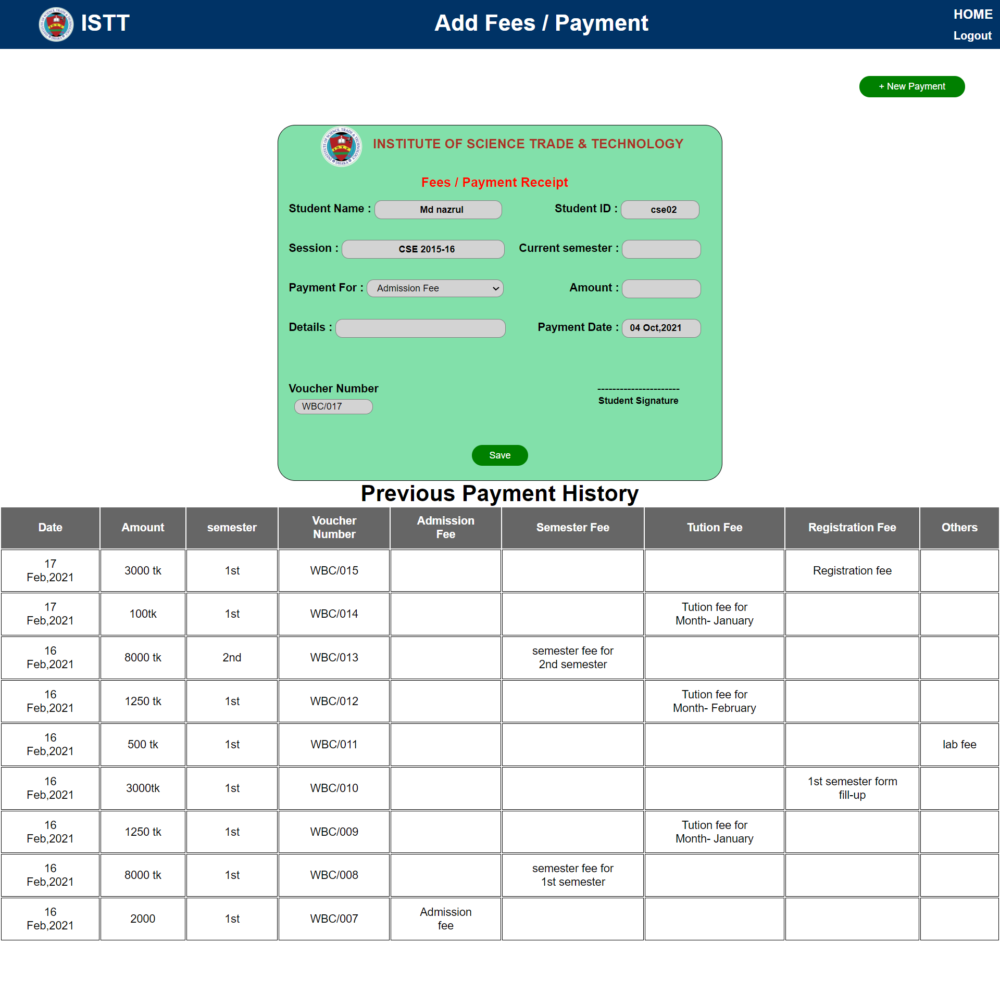
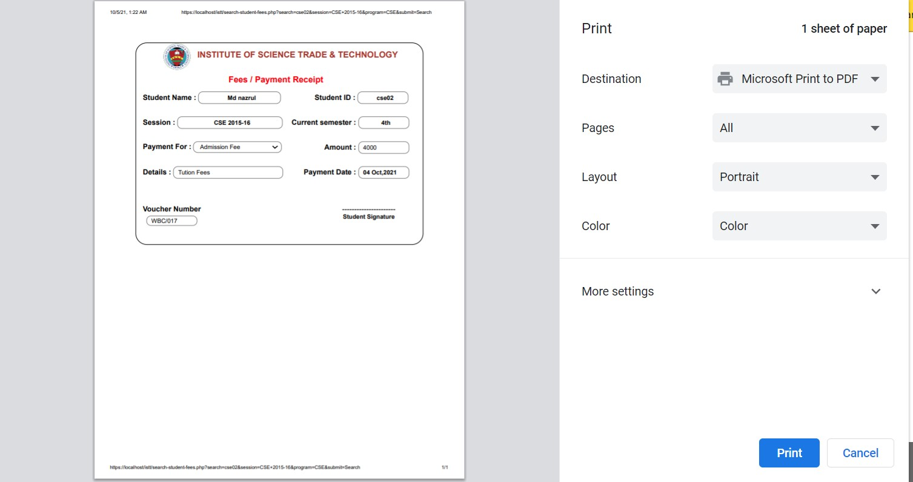
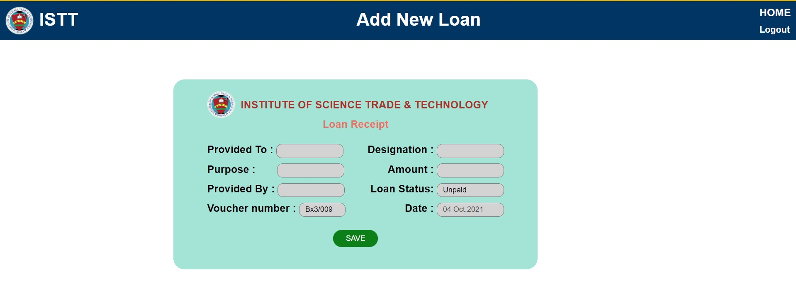
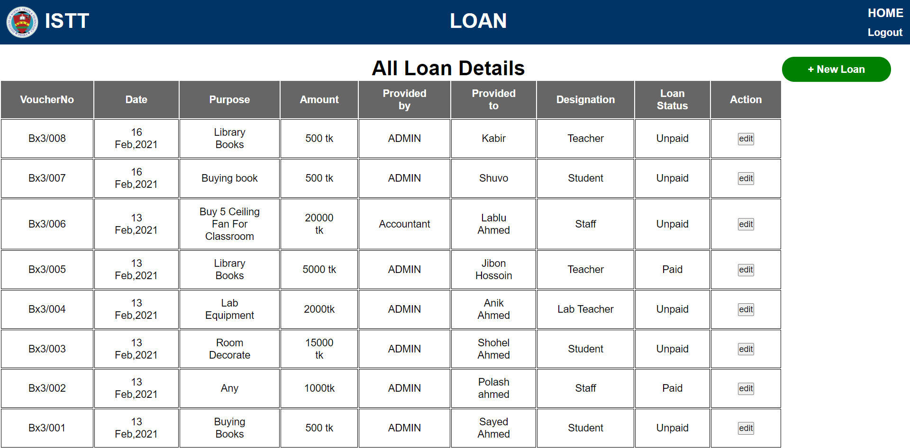
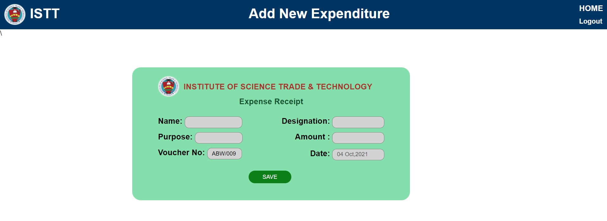
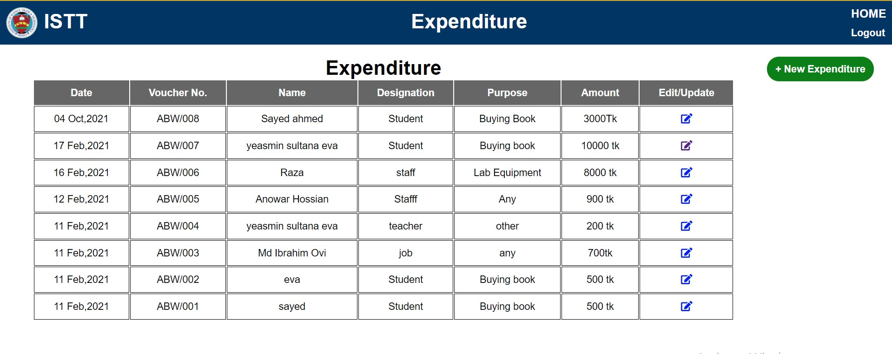

# Accounts System of ISTT

<h3>Abstract :-</h3>

The Accounts System of ISTT is an application for maintaining a student's account. In this project, we tried to show the working of account system and cover the basic functionality of Account System. To develop a project for solving financial applications of a student. The main aim of this project is to develop software for account system. This project has been developed to carry out the processes easily and quickly, which is not possible with the manuals systems, which are overcome by this software. It will save transaction time and therefore increase the efficiency of the system. This project will developed using PHP, HTML language and MYSQL use for database connection. The system design will implemented with MYSQL, PHP and HTML. The system will be designed as an interactive and content management system. The content management system deals with data entry, validation confirm and updating whiles the interactive system deals with system interaction with the administration and users.

<h3>Aims :</h3>

The aim of my project is to develop a wed based application for account system of ISTT. Using this application admin can check student payment details, update their records, check total income & expense of institution.it is also time consuming. Converting ISTT's account system to Web-Based account system software from the old method.

<h3>Objective:</h3>

•	To reduce paperwork.

•	To make storage of information more efficient and secure.

•	To have a user friendly interface.

•	To operate it easily and with minimum experience.

•	To save time and energy of the Admin.
 
<h3>Log-in page :-</h3>

<h3>Dashboard :-</h3>

<h3>Add New Student :-</h3>

<h3>All Student :-</h3>

<h3>Add Payment :-</h3>

<h3>Payment Receipt :-</h3>

<h3>Add Loan :-</h3>

<h3>Load Details :-</h3>

<h3>Add Expenditure :-</h3>

<h3>Expenditure Details :-</h3>

<h3>Change Password :-</h3>

